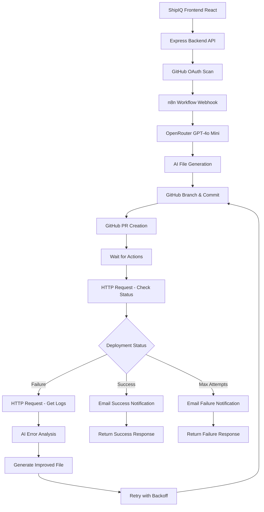

# 🚀 ShipIQ Complete DevOps Automation Platform

## 🎯 **What We've Built**

### ✅ **Complete End-to-End DevOps Automation:**

1. **🔍 Repository Analysis** - GitHub OAuth-based repository scanning
2. **📁 AI File Generation** - OpenRouter GPT-4o Mini powered Dockerfile, CI/CD, README generation
3. **🌿 GitHub Integration** - Automatic branch creation, file commits, PR creation  
4. **⚡ Deployment Monitoring** - Real-time GitHub Actions status tracking
5. **🔄 Auto-Retry Logic** - Intelligent retry with AI-powered improvements
6. **📊 Multi-Attempt Strategies** - Up to 3 attempts with exponential backoff
7. **🤖 AI Error Analysis** - Smart failure diagnosis and file improvements
8. **📧 Email Notifications** - Gmail integration for deployment status updates

## 🏗️ **Architecture Overview**



## 📋 **Setup Instructions**

### **1. Backend Environment Configuration**

Create `backend/.env`:
```env
# n8n Workflow Configuration
N8N_WEBHOOK_URL=http://localhost:5678/webhook/shipiq-agent-full

# GitHub OAuth Configuration
GITHUB_CLIENT_ID=your_github_client_id
GITHUB_CLIENT_SECRET=your_github_client_secret
GITHUB_TOKEN=your_github_personal_access_token
SESSION_SECRET=your_session_secret

# Server Configuration
PORT=5000
NODE_ENV=development

# GitHub Webhook Secret (for webhook verification)
GITHUB_WEBHOOK_SECRET=your_webhook_secret
```

### **2. Frontend Environment Configuration**

Create `frontend/.env`:
```env
VITE_API_URL=http://localhost:5000
```

### **3. n8n Workflow Setup**

#### **Install n8n:**
```bash
npm install -g n8n
n8n start
```

#### **Import Main Workflow:**
1. Open n8n at `http://localhost:5678`
2. Import `ShipIQ_DevOps_Agent_HTTP_Requests.json`
3. Configure credentials:
   - **GitHub OAuth API**: Use your GitHub OAuth app credentials
   - **Gmail SMTP**: For email notifications
   - **OpenRouter API**: Set `OPENROUTER_API_KEY` environment variable

#### **Environment Variables in n8n:**
1. Go to **Settings** → **Environment Variables**
2. Add: `OPENROUTER_API_KEY=sk-or-v1-your-api-key-here`

#### **Activate Workflow:**
1. Click **"Active"** toggle
2. Note webhook URL: `http://localhost:5678/webhook/shipiq-agent-full`

### **4. GitHub OAuth App Setup**

#### **Create GitHub OAuth App:**
1. Go to GitHub → **Settings** → **Developer settings** → **OAuth Apps**
2. Click **"New OAuth App"**
3. Fill in:
   - **Application name**: `ShipIQ DevOps Agent`
   - **Homepage URL**: `http://localhost:3000`
   - **Authorization callback URL**: `http://localhost:5000/auth/github/callback`
4. Note down `Client ID` and `Client Secret`

#### **Create GitHub Personal Access Token:**
1. Go to GitHub → **Settings** → **Developer settings** → **Personal access tokens** → **Tokens (classic)**
2. Click **"Generate new token (classic)"**
3. Select scopes:
   - ✅ `repo` (Full control of private repositories)
   - ✅ `workflow` (Update GitHub Action workflows)
   - ✅ `admin:repo_hook` (Full control of repository hooks)
   - ✅ `read:user` (Read user profile data)

### **5. GitHub Webhook Setup (Optional)**

#### **Configure Repository Webhooks:**
1. Go to your GitHub repository
2. **Settings** → **Webhooks** → **Add webhook**
3. **Payload URL**: `http://YOUR_DOMAIN:5000/api/github/webhook`
4. **Content type**: `application/json`
5. **Events**: Select these events:
   - ✅ `Workflow runs`
   - ✅ `Pull requests`
   - ✅ `Deployments`
   - ✅ `Deployment status`

### **6. OpenRouter API Setup**

#### **Get OpenRouter API Key:**
1. Go to [OpenRouter.ai](https://openrouter.ai/)
2. Sign up/Login to your account
3. Go to **Keys** section
4. Create a new API key
5. Copy the key (starts with `sk-or-v1-...`)

#### **Add to n8n Environment Variables:**
1. In n8n, go to **Settings** → **Environment Variables**
2. Add: `OPENROUTER_API_KEY=sk-or-v1-your-actual-key-here`
3. Restart n8n to load the new variable

## 🧩 **n8n Workflow Node Functions**

### **📥 Input & Data Processing:**
1. **Webhook - Receive Repo Data**
   - Receives POST requests from backend
   - Webhook path: `shipiq-agent-full`
   - Accepts JSON with repository metadata and gap report

2. **Extract & Prepare Data**
   - Parses incoming JSON data
   - Extracts repository info, language, dependencies
   - Determines file type to generate (dockerfile/ci-cd/readme)
   - Creates unique branch names and commit messages

3. **Route by File Type**
   - Routes to appropriate AI generator based on gap report
   - Three paths: Dockerfile, CI/CD, README generation

### **🤖 AI Generation Nodes:**
4. **Generate Dockerfile (OpenRouter)**
   - HTTP Request to OpenRouter API
   - Uses GPT-4o Mini model
   - Generates production-ready Dockerfiles with error handling

5. **Generate CI/CD (OpenRouter)**
   - HTTP Request to OpenRouter API
   - Creates GitHub Actions workflows
   - Includes comprehensive testing and deployment steps

6. **Generate README (OpenRouter)**
   - HTTP Request to OpenRouter API
   - Generates professional documentation
   - Includes installation, usage, and troubleshooting sections

### **📄 Response Processing:**
7. **Process AI Response**
   - Extracts generated content from OpenRouter response
   - Cleans up markdown formatting
   - Prepares data for GitHub commit

### **🌿 GitHub Integration:**
8. **GitHub - Create Branch & Commit**
   - Creates new branch: `shipiq-devops-{type}-{timestamp}`
   - Commits generated file to branch
   - Uses GitHub OAuth credentials

9. **GitHub - Create Issue/PR**
   - Creates issue with PR-style description
   - Includes file preview and review checklist
   - Adds relevant labels

### **⏱️ Monitoring & Wait:**
10. **Wait for GitHub Actions**
    - 30-second delay for Actions to start
    - Allows time for workflow initialization

11. **HTTP - Check Actions Status**
    - HTTP Request to GitHub Actions API
    - Gets latest workflow run status
    - Checks for completion (success/failure/cancelled)

### **🧠 Analysis & Routing:**
12. **Analyze Actions Status**
    - Processes GitHub Actions response
    - Determines next action (success/retry/wait/failure)
    - Implements retry logic with attempt counting

13. **Route by Deployment Status**
    - Routes based on deployment outcome
    - Success → Return success response
    - Failure → Trigger retry workflow
    - Wait → Continue monitoring
    - Max attempts → Return failure

### **🔄 Retry Logic:**
14. **HTTP - Get Workflow Logs**
    - Fetches detailed logs from failed workflow
    - Provides context for AI error analysis

15. **AI - Fix Deployment Issues**
    - Uses OpenRouter to analyze failure
    - Generates improved file with fixes
    - Includes better error handling and debugging

16. **Prepare Retry Attempt**
    - Creates new branch for retry
    - Updates attempt counter
    - Prepares improved content for commit

17. **Wait Before Retry (Backoff)**
    - Exponential backoff: 30s → 60s → 120s
    - Prevents API rate limiting

### **📤 Response & Notifications:**
18. **Respond - Success**
    - Returns structured success response
    - Includes deployment details and URLs

19. **Respond - Max Attempts Reached**
    - Returns failure response after 3 attempts
    - Includes error details and logs

20. **Email - Notify**
    - Sends Gmail notifications
    - Success/failure/retry status updates
    - Includes repository and deployment details

## 🔄 **Workflow Execution Flow**

### **Phase 1: Frontend to Backend**
```
1. User authenticates with GitHub OAuth
2. User selects repository from dropdown
3. User clicks "Generate Missing Files"
4. Frontend calls backend /api/generate-files endpoint
5. Backend generates gap report (what's missing)
6. Backend fetches repository metadata (package.json)
7. Backend calls n8n webhook with structured data
```

### **Phase 2: AI File Generation**
```
8. n8n receives webhook data
9. n8n extracts and prepares repository information
10. n8n routes to appropriate AI generator based on gap report
11. OpenRouter GPT-4o Mini generates optimized file
12. n8n processes AI response and cleans formatting
```

### **Phase 3: GitHub Integration**
```
13. n8n creates GitHub branch: `shipiq-devops-{type}-{timestamp}`
14. n8n commits generated file to branch
15. n8n creates issue/PR with detailed description
16. n8n waits 30 seconds for GitHub Actions to initialize
```

### **Phase 4: Deployment Monitoring**
```
17. n8n polls GitHub Actions API for status
18. n8n analyzes workflow run results (success/failure/cancelled)
19. n8n routes based on deployment outcome:
    - SUCCESS → Send email notification → Return success response
    - FAILURE → Trigger retry workflow (see Phase 5)
    - WAIT → Continue polling
    - MAX ATTEMPTS → Send failure email → Return failure response
```

### **Phase 5: Auto-Retry Logic (Failure Path)**
```
20. n8n fetches detailed workflow logs
21. n8n uses AI to analyze failure and generate improved file
22. n8n creates new retry branch with attempt counter
23. n8n waits with exponential backoff (30s → 60s → 120s)
24. n8n commits improved file and repeats from step 14
25. Maximum 3 attempts before giving up
```

## 🧠 **AI-Powered Error Analysis**

### **Smart Failure Detection:**
- **Docker Build Failures** → Improved base images, dependency handling
- **CI/CD Pipeline Issues** → Better error handling, retry logic
- **Test Failures** → Enhanced test configuration, debugging
- **Permission Issues** → Proper user management, security fixes
- **Resource Constraints** → Optimized resource allocation

### **Multi-Attempt Strategies:**
1. **Attempt 1**: Standard optimized file
2. **Attempt 2**: AI-analyzed improvements with error handling
3. **Attempt 3**: Fallback with maximum compatibility mode

## 📊 **Response Format**

### **Success Response:**
```json
{
  "success": true,
  "action": "success",
  "status": "success",
  "repository": {
    "owner": "username",
    "name": "repo-name",
    "url": "https://github.com/username/repo-name"
  },
  "file": {
    "type": "dockerfile",
    "name": "Dockerfile",
    "path": "Dockerfile",
    "size": 1234
  },
  "deployment": {
    "status": "success",
    "runId": "12345678",
    "runUrl": "https://github.com/username/repo-name/actions/runs/12345678",
    "attempt": 1,
    "maxAttempts": 3
  },
  "timestamp": "2024-01-01T12:00:00.000Z",
  "message": "Deployment completed successfully"
}
```

### **Failure Response:**
```json
{
  "success": false,
  "action": "max_attempts_reached",
  "status": "failure",
  "repository": {
    "owner": "username",
    "name": "repo-name",
    "url": "https://github.com/username/repo-name"
  },
  "error": {
    "message": "Workflow run 12345678 failed",
    "runId": "12345678",
    "runUrl": "https://github.com/username/repo-name/actions/runs/12345678",
    "attempts": 3,
    "maxAttempts": 3
  },
  "timestamp": "2024-01-01T12:00:00.000Z",
  "message": "Deployment failed after 3 attempts. Manual intervention required."
}
```

## 🚀 **Starting the System**

### **1. Start Backend Server:**
```bash
cd backend
npm install
npm start
```
Backend will run on `http://localhost:5000`

### **2. Start Frontend Development Server:**
```bash
cd frontend
npm install
npm run dev
```
Frontend will run on `http://localhost:3000`

### **3. Start n8n Workflow Engine:**
```bash
n8n start
```
n8n will run on `http://localhost:5678`

### **4. Verify All Services:**
- ✅ Backend API: `http://localhost:5000`
- ✅ Frontend App: `http://localhost:3000`
- ✅ n8n Interface: `http://localhost:5678`
- ✅ n8n Webhook: `http://localhost:5678/webhook/shipiq-agent-full`

## 🔧 **Testing the Integration**

### **1. Test Frontend to Backend Flow:**
1. Go to `http://localhost:3000`
2. Click "Connect GitHub" to authenticate
3. Select a repository from the dropdown
4. Click "Generate Missing Files"
5. Watch the frontend for generated file display

### **2. Test n8n Webhook Directly:**
```bash
curl -X POST http://localhost:5678/webhook/shipiq-agent-full \
  -H "Content-Type: application/json" \
  -d '{
    "input_value": "{\"language\":\"JavaScript\",\"gap_report\":[\"missing_dockerfile\"],\"repository\":{\"owner\":\"your-username\",\"name\":\"test-repo\",\"url\":\"https://github.com/your-username/test-repo\"},\"metadata\":{\"name\":\"test-app\",\"scripts\":{\"start\":\"node index.js\"}}}"
  }'
```

### **3. Test Backend API Directly:**
```bash
curl -X POST http://localhost:5000/api/generate-files \
  -H "Content-Type: application/json" \
  -d '{
    "repoUrl": "https://github.com/your-username/your-repo"
  }'
```

## 🔍 **Troubleshooting**

### **Common Issues:**

#### **1. "Authorization failed" in n8n:**
- **Cause**: Missing OpenRouter API key
- **Fix**: Add `OPENROUTER_API_KEY` to n8n environment variables
- **Verify**: Restart n8n after adding the key

#### **2. "fetchPackageJson is not a function":**
- **Cause**: Backend server needs restart after code changes
- **Fix**: Restart backend server with `npm start`

#### **3. Empty n8n response:**
- **Cause**: Webhook URL mismatch or workflow not active
- **Fix**: Verify webhook URL matches: `shipiq-agent-full`
- **Check**: Ensure workflow is ACTIVE in n8n

#### **4. GitHub authentication errors:**
- **Cause**: Invalid OAuth credentials or token expired
- **Fix**: Regenerate GitHub Personal Access Token
- **Check**: Verify OAuth app callback URL is correct

#### **5. Frontend shows "Invalid Date":**
- **Cause**: n8n response format issue
- **Fix**: Check n8n workflow execution logs for errors
- **Verify**: OpenRouter API key is working

### **Debug Steps:**
1. **Check Backend Logs**: Look for API call errors
2. **Check n8n Execution Logs**: Go to n8n → Executions tab
3. **Verify Credentials**: Test GitHub OAuth and OpenRouter API
4. **Test Components**: Test each service individually
5. **Check Network**: Ensure all services can communicate

## 🚀 **Advanced Features**

### **1. Deployment Analytics:**
- Success/failure rates per repository
- Average retry attempts needed
- Common failure patterns
- Performance metrics

### **2. Smart Retry Strategies:**
- Exponential backoff between retries
- Context-aware error analysis
- Progressive improvement algorithms
- Fallback compatibility modes

### **3. Integration Extensions:**
- Slack notifications for deployment status
- Email alerts for failures
- Dashboard for monitoring all deployments
- API for external integrations

## 🎯 **Next Steps**

1. **Deploy to Production** - Set up HTTPS, domain, and production GitHub OAuth
2. **Add Monitoring** - Implement logging, metrics, and alerting
3. **Scale AI Models** - Add more specialized models for different tech stacks
4. **Expand Integrations** - Add support for GitLab, Azure DevOps, etc.
5. **Build Dashboard** - Create admin panel for monitoring and management

---

## 🎉 **Congratulations!**

You now have a **complete end-to-end DevOps automation platform** that:

### **✅ What ShipIQ Can Do:**
- **🔍 Repository Analysis** - Scans GitHub repos for missing DevOps files
- **🤖 AI File Generation** - Creates optimized Dockerfiles, CI/CD workflows, and README files
- **🌿 GitHub Integration** - Automatically creates branches, commits files, and opens PRs
- **⚡ Deployment Monitoring** - Tracks GitHub Actions workflow status in real-time
- **🔄 Smart Retry Logic** - AI-powered error analysis and automatic retry with improvements
- **📧 Email Notifications** - Sends status updates via Gmail integration
- **📊 Multi-Attempt Strategy** - Up to 3 attempts with exponential backoff
- **🛡️ Error Handling** - Comprehensive error detection and recovery

### **🏗️ Technical Stack:**
- **Frontend**: React + Vite + Tailwind CSS
- **Backend**: Node.js + Express + GitHub OAuth
- **Workflow Engine**: n8n with HTTP Request nodes
- **AI Model**: OpenRouter GPT-4o Mini
- **Version Control**: GitHub API integration
- **Notifications**: Gmail SMTP

### **🚀 Production Ready Features:**
- **Secure Authentication** - GitHub OAuth with proper scopes
- **Robust Error Handling** - Comprehensive error detection and recovery
- **Scalable Architecture** - Modular design with clear separation of concerns
- **Real-time Monitoring** - Live deployment status tracking
- **AI-Powered Intelligence** - Smart failure analysis and improvement suggestions

**ShipIQ is now a true AI-powered DevOps engineer that can autonomously enhance any GitHub repository!** 🤖🚀

---

### **📚 Quick Reference:**
- **Frontend**: `http://localhost:3000`
- **Backend API**: `http://localhost:5000`
- **n8n Interface**: `http://localhost:5678`
- **Webhook URL**: `http://localhost:5678/webhook/shipiq-agent-full`
- **Active Workflow**: `ShipIQ_DevOps_Agent_HTTP_Requests.json`

